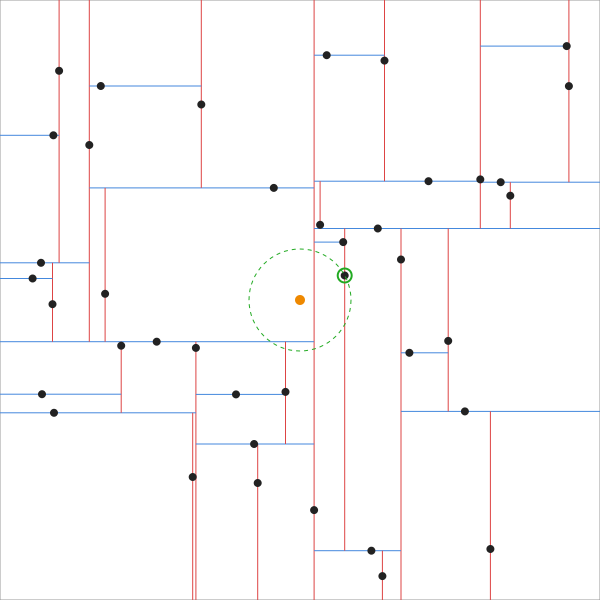

# kdtree-python

A small k-d tree written from scratch in Python. No dependencies.

A k-d tree is a binary tree for points in space. Every level of the tree
splits the points along one axis, and the axis cycles as you go deeper
(x, y, x, y, ...). That structure is what lets you answer "which point is
closest to this one?" without checking every single point.



Red lines are x splits, blue lines are y splits. The orange point is the
query, the circled point is the nearest neighbor the tree found.

## Files

- `node.py` - the tree node, just a point and two children
- `kdtree.py` - building the tree, insert, and nearest neighbor search
- `benchmark.py` - times the tree against a brute force scan

## How it works

**Building:** sort the points along the current axis, put the median in the
node, recurse on the left half and the right half. Using the median keeps the
tree balanced.

**Nearest neighbor:** walk down the side of the tree the target falls on and
keep the best point seen so far. On the way back up, the other side of a split
only gets searched if the splitting line is closer to the target than the
current best - if it isn't, nothing over there can win, so the whole branch is
skipped. That skipping is where all the speed comes from.

## Usage

```python
from kdtree import KDTree

tree = KDTree([(2, 3), (5, 4), (9, 6), (4, 7), (8, 1), (7, 2)])
tree.insert((6, 6))
tree.nearest((6, 3))   # -> (7, 2)
```

## Benchmark

`python3 benchmark.py` runs 100 nearest neighbor queries at different sizes:

```
1000 points: kd-tree 0.0015s, brute force 0.0169s
10000 points: kd-tree 0.0014s, brute force 0.1411s
100000 points: kd-tree 0.0020s, brute force 1.4082s
```

Brute force grows linearly with the number of points, the tree barely moves.
